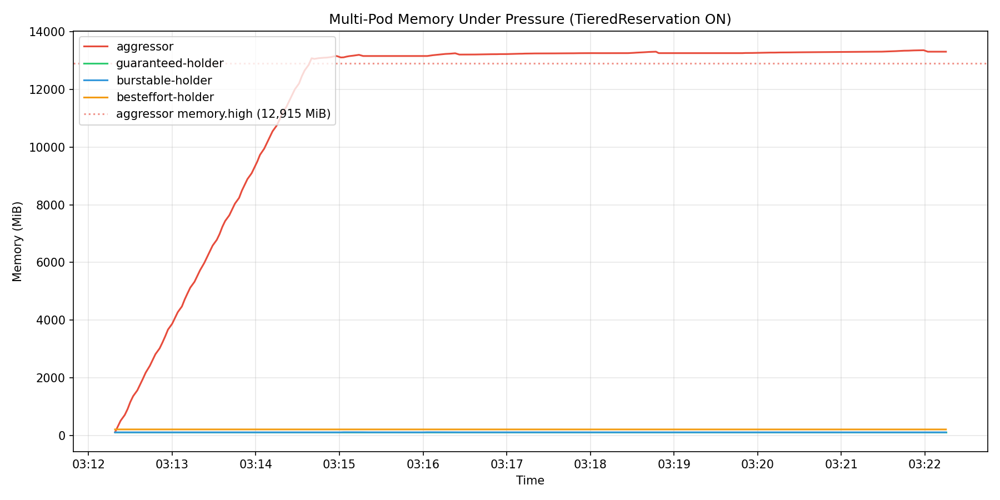
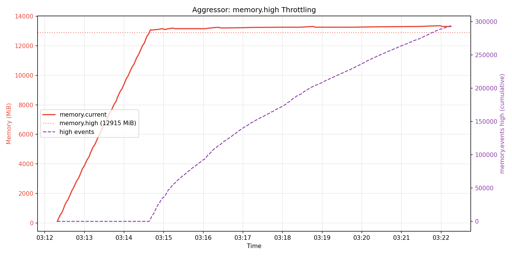
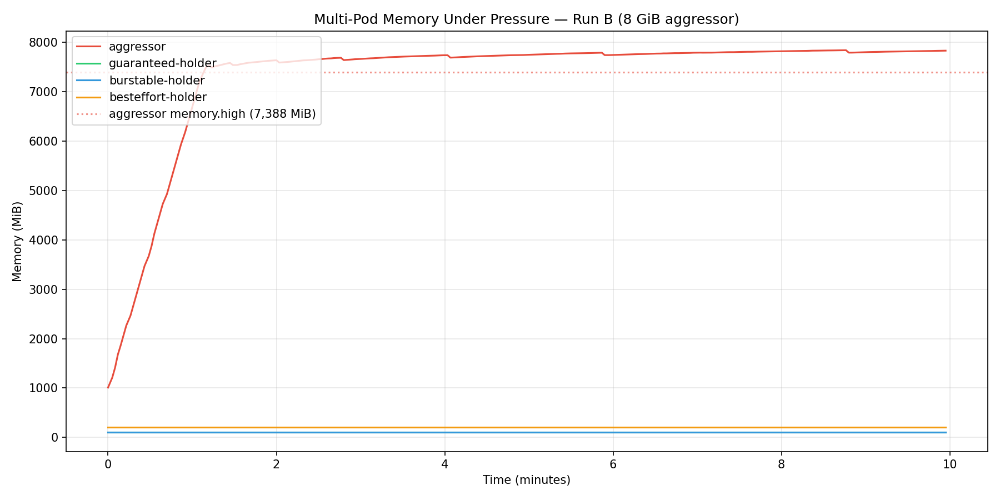
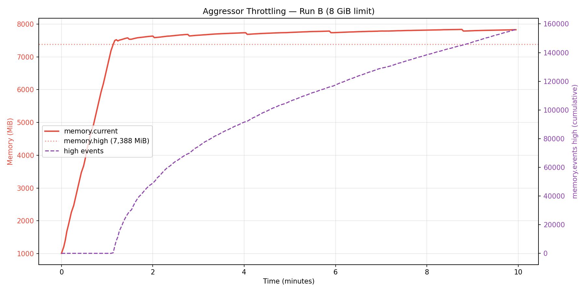
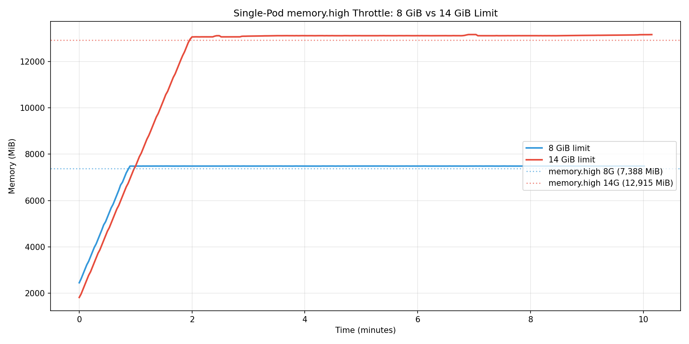

# KEP-2570: MemoryQoS Benchmark Results (Beta)

Beta graduation benchmarks on a build that includes the BestEffort memory.high fix ([kubernetes/kubernetes#138139](https://github.com/kubernetes/kubernetes/pull/138139)), the rollback cleanup PRs ([#138903](https://github.com/kubernetes/kubernetes/pull/138903), [#139377](https://github.com/kubernetes/kubernetes/pull/139377)), and all other MemoryQoS changes merged to master through 2026-06-01.

See [README.md](README.md) for the Alpha benchmark results run on commit [c8468eacac5](https://github.com/sohankunkerkar/kubernetes/commit/c8468eacac5).

---

## Test Environment

| Component | Version |
|-----------|---------|
| Kernel | 7.0.9-205.fc44.x86_64 |
| Kubelet | v1.37.0-alpha.0.1256+dc7be641101f4a-dirty (master, includes [dc7be641](https://github.com/kubernetes/kubernetes/commit/dc7be641101f4ad0ba4d13478e65839b0fa7deb2)) |
| Container Runtime | CRI-O 1.34.3 ,CRI-O 1.37.0 |
| Cluster | local-up-cluster.sh, single node |
| cgroup | v2 |
| Node allocatable memory | 32388480Ki (30.9 GiB) |

Kubelet configuration: `MemoryQoS=true`, `memoryReservationPolicy=TieredReservation`, `memoryThrottlingFactor=0.9` (default).

Data was collected by polling cgroup files every 1s from the container's cgroup path on the node. Collection script: [`scripts/collect-cgroup-data.sh`](scripts/collect-cgroup-data.sh).

---

## 1. memory.high Throttle Behavior

**Pod spec**: [`manifests/throttle-test-pod.yaml`](manifests/throttle-test-pod.yaml) - Burstable pod, requests=256Mi, limits=512Mi.

`memory.high` = floor[(256 + 0.9 * (512 - 256)) / 4096] * 4096 = 486 MiB (510025728 bytes)

| Metric | alpha | beta |
|--------|-------------|-------|
| Time to reach memory.high | ~49s | ~41s |
| Peak memory | 511 MiB | 511 MiB |
| Total `memory.events` high counter | 3,596 | 4,234 |
| Duration to OOM-kill | 71s | 54s |
| Pod exit reason | OOMKilled | OOMKilled |

Behavior is consistent: the container progresses through throttling to OOM-kill. Timing variation is expected across runs (the alpha repeated trials showed 59-65s, ~9% spread).

Raw data: [`data/01-throttle-test-factor-0.9-v2.csv`](data/01-throttle-test-factor-0.9-v2.csv)

---

## 2. Tiered Memory Protection

Guaranteed pods get `memory.min` (hard protection). Burstable pods get `memory.low` (soft protection). BestEffort pods now get `memory.high` set (fixed in [#138139](https://github.com/kubernetes/kubernetes/pull/138139)).

| QoS Class | memory.min | memory.low | memory.high |
|-----------|-----------|-----------|------------|
| Guaranteed (req=lim=256Mi) | 256 MiB | 0 | max |
| Burstable (req=128Mi, lim=256Mi) | 0 | 128 MiB | 243 MiB |
| **BestEffort** | **0** | **0** | **28,556 MiB** |

**BestEffort fix**: In the alpha run, `memory.high` was `max` (no throttling). Now it is correctly set to `floor[(0.9 * node_allocatable) / pageSize] * pageSize` per the KEP formula. This was fixed by [kubernetes/kubernetes#138139](https://github.com/kubernetes/kubernetes/pull/138139) — the code previously treated `request == limit` (both 0) as Guaranteed, skipping memory.high.

### Multi-container pod (Burstable)

| Resource | memory.low | memory.high |
|----------|-----------|------------|
| Container A (req=128Mi, lim=256Mi) | 128 MiB | 243 MiB |
| Container B (req=64Mi, lim=128Mi) | 64 MiB | 121 MiB |
| **Pod total** | **192 MiB** | -- |

### Cgroup hierarchy

| Level | memory.min | memory.low |
|-------|-----------|-----------|
| kubepods.slice | 518 MiB | 0 |
| kubepods-burstable.slice | 0 | 262 MiB |

kubepods root `memory.min` = sum of Guaranteed `memory.min` + Burstable `memory.low`: 256 MiB (guaranteed-test) + 192 MiB (multi-container) + 70 MiB (coredns) = 518 MiB. Burstable QoS `memory.low` = 192 MiB + 70 MiB = 262 MiB. The parent must cover both hard and soft protection for the hierarchy to be effective.

Raw data: [`data/v2-tiered-protection.txt`](data/v2-tiered-protection.txt)

---

## 3. Rollback Safety

Burstable pod (requests=128Mi, limits=256Mi). Disabled MemoryQoS by setting `MemoryQoS: false` and removing `memoryReservationPolicy`, then restarted kubelet.

| Level | Knob | Before | After | Status |
|-------|------|--------|-------|--------|
| kubepods root | memory.min | 198 MiB | **0** | Cleared at kubelet startup ([#138903](https://github.com/kubernetes/kubernetes/pull/138903)) |
| burstable QoS | memory.low | 198 MiB | **0** | Cleared at kubelet startup ([#138903](https://github.com/kubernetes/kubernetes/pull/138903)) |
| pod level | memory.low | 128 MiB | 128 MiB | Stale — neutralized (parent=0 wins) |
| container | memory.low | 128 MiB | 128 MiB | Stale — neutralized (parent=0 wins) |
| container | memory.high | 243 MiB | 243 MiB | Stale — cleared on container restart or InPlacePodResize ([#139377](https://github.com/kubernetes/kubernetes/pull/139377)) |

QoS-class level cleanup works correctly. Pod-level and container-level values persist but are effectively neutralized because cgroup v2 memory protection is hierarchical (parent=0 wins). Container-level `memory.high` persists until the container is restarted or resized via InPlacePodResize.

Raw data: [`data/v2-rollback-safety-test.txt`](data/v2-rollback-safety-test.txt)

---

## 4. InPlacePodResize + Rollback

Burstable pod (requests=128Mi, limits=256Mi) with `resizePolicy: NotRequired`. Created with MemoryQoS enabled, then disabled MemoryQoS and restarted kubelet, then triggered in-place resize (128Mi/256Mi → 192Mi/384Mi).

| Level | Knob | Before Rollback | After Rollback | After Resize | Status |
|-------|------|-----------------|----------------|--------------|--------|
| kubepods root | memory.min | 198 MiB | **0** | 0 | Cleared at kubelet startup ([#138903](https://github.com/kubernetes/kubernetes/pull/138903)) |
| burstable QoS | memory.low | 198 MiB | **0** | 0 | Cleared at kubelet startup ([#138903](https://github.com/kubernetes/kubernetes/pull/138903)) |
| pod level | memory.low | 128 MiB | 128 MiB | 128 MiB | Stale — neutralized (parent=0 wins) |
| pod level | memory.max | 256 MiB | 256 MiB | **384 MiB** | Updated by resize |
| container | memory.low | 128 MiB | 128 MiB | 128 MiB | Stale — neutralized (parent=0 wins) |
| container | memory.high | 243 MiB | 243 MiB | **max** | Cleared by resize ([#139377](https://github.com/kubernetes/kubernetes/pull/139377)) |
| container | memory.max | 256 MiB | 256 MiB | **384 MiB** | Updated by resize |

InPlacePodResize clears stale `memory.high` after rollback without requiring a container restart. Requires a container runtime that passes the `Unified` map through `UpdateContainerResources` (e.g. CRI-O >= 1.36).

Raw data: [`data/v2-resize-rollback-test.txt`](data/v2-resize-rollback-test.txt)

---

## 5. Multi-Pod Memory Protection Under Pressure (TieredReservation ON)

**Pod specs**: [`manifests/pressure-test-holders.yaml`](manifests/pressure-test-holders.yaml), [`manifests/pressure-test-aggressor.yaml`](manifests/pressure-test-aggressor.yaml)

Kubelet config: `MemoryQoS=true`, `memoryReservationPolicy=TieredReservation`. Node allocatable: 30.9 GiB.

| Pod | QoS | Requests/Limits | Workload | Protection |
|-----|-----|-----------------|----------|------------|
| guaranteed-holder | Guaranteed | 256Mi/256Mi | hold 100Mi | memory.min=256Mi |
| burstable-holder | Burstable | 128Mi/512Mi | hold 100Mi | memory.low=128Mi |
| besteffort-holder | BestEffort | none | hold 200Mi | none |

### Run A: aggressor with 14 GiB limit

Aggressor: Burstable, requests=128Mi, limits=14Gi, allocating 50Mi/0.5s (~100Mi/s).

| Metric | Value |
|--------|-------|
| Aggressor memory.high | 12,915 Mi (~12.6 GiB) |
| Time to reach memory.high | ~2m21s |
| Peak aggressor memory | ~13,362 Mi (~13.0 GiB) |
| Aggressor memory.events high (at 10min) | 293,678 |
| Aggressor outcome | Throttled at memory.high, still running at 10min |
| Node total RAM | 31.7 GiB |
| Node available memory at test start | ~13 GiB(`MemAvailable` from `/proc/meminfo`) |
| Kill order | none — all pods survived |

The aggressor ramped linearly from 104Mi to ~12,860Mi in ~2m21s with `high=0`. Once it crossed `memory.high` (~12.6 GiB), the kernel began throttling: memory plateaued at ~13.1-13.3 GiB while the `high` event counter climbed rapidly (3,058 → 293,678 over ~8 minutes). The aggressor was still running when the monitor timed out at 10 minutes — `memory.high` throttling effectively capped it without OOM-killing.

All three holder pods remained stable throughout (guaranteed: 106Mi, burstable: 104-108Mi, besteffort: 204Mi, all `high=0`, `oom_kill=0`).

Raw data: [`data/multi-pod-pressure-runA-14g.csv`](data/multi-pod-pressure-runA-14g.csv), [`data/multi-pod-pressure-runA.txt`](data/multi-pod-pressure-runA.txt)

Monitor script: [`scripts/monitor-pressure-test.sh`](scripts/monitor-pressure-test.sh). Plot script: [`scripts/plot-pressure-test.py`](scripts/plot-pressure-test.py)

### Run B: aggressor with 8 GiB limit

Aggressor: Burstable, requests=128Mi, limits=8Gi, allocating 50Mi/0.5s (~100Mi/s). Pod spec: [`manifests/pressure-test-aggressor-8g.yaml`](manifests/pressure-test-aggressor-8g.yaml).

| Metric | Value |
|--------|-------|
| Aggressor memory.high | 7,388 Mi (~7.2 GiB) |
| Time to reach memory.high | ~68s |
| Peak aggressor memory | ~7,828 Mi (~7.6 GiB) |
| Aggressor memory.events high (at 10min) | 156,161 |
| Aggressor outcome | Throttled at memory.high, still running at 10min |
| Node total RAM | 31.7 GiB |
| Node available memory at test start | ~16 GiB |
| Kill order | none — all pods survived |

Same behavior as Run A: the aggressor ramped linearly until hitting `memory.high` (~7.4 GiB) at ~68s, then plateaued at ~7.8 GiB while `high` events climbed to 156,161 over ~9 minutes. Despite ~8.2 GiB of node headroom above `memory.high`, the kernel's per-cgroup reclaim prevented the process from reaching `memory.max` (see [section 6 analysis](#6-single-pod-memoryhigh-throttle-sustained-behavior)).

All three holder pods remained stable throughout (guaranteed: 110Mi, burstable: 104Mi, besteffort: 205Mi, all `high=0`, `oom_kill=0`).

Raw data: [`data/multi-pod-8g-test.csv`](data/multi-pod-8g-test.csv)

---

## 6. Single-Pod memory.high Throttle Sustained Behavior

Tests to characterize how `memory.high` throttling behaves for a single aggressor pod with sustained memory allocation, with no other pods competing for memory.

Kubelet config: `MemoryQoS=true`, `memoryReservationPolicy=TieredReservation`. Node allocatable: 30.9 GiB. Node available at test start: ~16 GiB.

Aggressor workload: allocating 50Mi every 0.5s via mmap + page fault (same as section 5).

### Narrow-gap pod (requests=10Mi, limits=20Mi, gap=1Mi)

Pod spec: [`manifests/lkml-narrow-gap-test-pod.yaml`](manifests/lkml-narrow-gap-test-pod.yaml). Allocating 1Mi every 3s. This pod has only a 1 Mi gap between `memory.high` (19 Mi) and `memory.max` (20 Mi).

| Metric | Value |
|--------|-------|
| memory.high | 19 Mi |
| memory.max | 20 Mi |
| Gap (memory.max - memory.high) | 1 Mi |
| Outcome | **OOM-killed after ~44s** |

With only a 1 Mi gap, the process overshoots `memory.high` and reaches `memory.max` before the kernel can reclaim — normal OOM-kill behavior.

Reference: [LKML discussion on memory.high behavior](https://lkml.org/lkml/2023/6/1/1300)

### Wide-gap pod, 8 GiB limit (gap=804Mi)

Pod spec: [`manifests/pressure-test-aggressor-8g.yaml`](manifests/pressure-test-aggressor-8g.yaml).

| Metric | Value |
|--------|-------|
| memory.high | 7,388 Mi (~7.2 GiB) |
| memory.max | 8,192 Mi (8 GiB) |
| Gap (memory.max - memory.high) | 804 Mi |
| Time to reach memory.high | ~1m15s |
| Peak memory | ~7,487 Mi (~7.3 GiB) |
| memory.events high (at 10min) | 770,790 |
| Node headroom above memory.high | ~8.6 GiB |
| Outcome | **Throttled indefinitely — still running at 10min, never OOM-killed** |

### Wide-gap pod, 14 GiB limit (gap=1,421Mi)

Pod spec: [`manifests/pressure-test-aggressor.yaml`](manifests/pressure-test-aggressor.yaml).

| Metric | Value |
|--------|-------|
| memory.high | 12,915 Mi (~12.6 GiB) |
| memory.max | 14,336 Mi (14 GiB) |
| Gap (memory.max - memory.high) | 1,421 Mi |
| Time to reach memory.high | ~2m10s |
| Peak memory | ~13,159 Mi (~12.9 GiB) |
| memory.events high (at 10min) | 628,635 |
| Node headroom above memory.high | ~3.4 GiB |
| Outcome | **Throttled indefinitely — still running at 10min, never OOM-killed** |

### Analysis

The gap between `memory.high` and `memory.max` (`0.1 * (limits - requests)` at the default factor) determines the outcome. A 1 Mi gap is too small for reclaim to keep up — the process reaches `memory.max` and is OOM-killed normally. At 804 Mi and above, per-cgroup reclaim keeps pace with allocation and the process never reaches `memory.max`. This is not dependent on system-wide memory pressure — the 8 GiB pod had 8.6 GiB of free node memory.

| Test | Gap | Node headroom | Outcome |
|------|-----|---------------|---------|
| Narrow-gap (20 Mi limit) | 1 Mi | ~16 GiB | OOM-killed (44s) |
| Wide-gap (8 GiB limit) | 804 Mi | ~8.6 GiB | Throttled indefinitely |
| Wide-gap (14 GiB limit) | 1,421 Mi | ~3.4 GiB | Throttled indefinitely |

Raw data: [`data/livelock-8g-test.csv`](data/livelock-8g-test.csv), [`data/livelock-14g-single-test.csv`](data/livelock-14g-single-test.csv)

Plot script: [`scripts/plot-throttle-tests.py`](scripts/plot-throttle-tests.py)

---

## 7. Guaranteed Pod Page Cache Behavior ([#137880](https://github.com/kubernetes/kubernetes/issues/137880))

**Pod spec**: [`manifests/guaranteed-pageio-test-pod.yaml`](manifests/guaranteed-pageio-test-pod.yaml) — Guaranteed pod (512Mi/512Mi).

**Workload**: Allocate 300Mi anonymous memory, then repeatedly write+read 500Mi of page cache (10 x 50Mi files) per iteration. Each iteration requires the kernel to reclaim ~288Mi of page cache to stay within the 512Mi limit.

### Run 1: TieredReservation (memory.min = 512Mi)

Kubelet config: `MemoryQoS: true`, `memoryReservationPolicy: TieredReservation`.

| Metric | Value |
|--------|-------|
| memory.min | 536870912 (512 MiB) |
| memory.max | 536870912 (512 MiB) |
| memory.high | max |
| Iterations completed | 0 (OOM-killed during first iteration) |
| Outcome | **OOM-killed** (reproduced twice) |

With `memory.min = memory.max`, the kernel cannot reclaim page cache within the cgroup. After writing ~4 files (~200Mi page cache), anonymous (300Mi) + page cache exceeds `memory.max` and the container is OOM-killed.

### Run 2: memoryReservationPolicy: None (memory.min = 0)

Kubelet config: `MemoryQoS: true`, `memoryReservationPolicy: None`.

| Metric | Value |
|--------|-------|
| memory.min | 0 |
| memory.max | 536870912 (512 MiB) |
| memory.high | max |
| memory.current | 461-511 MiB (oscillating) |
| Iterations completed | 19+ |
| oom_kill | 0 |
| Outcome | **Survived** |

With `memory.min=0`, page cache is freely reclaimable regardless of whether MemoryQoS is enabled.

### Run 3: MemoryQoS disabled (memory.min = 0)

Kubelet config: `MemoryQoS: false`. Pod: [`manifests/guaranteed-pageio-no-memqos-pod.yaml`](manifests/guaranteed-pageio-no-memqos-pod.yaml).

| Metric | Value |
|--------|-------|
| memory.min | 0 |
| memory.max | 536870912 (512 MiB) |
| memory.high | max |
| memory.current | 461-511 MiB (oscillating) |
| Iterations completed | 81+ |
| oom_kill | 0 |
| Outcome | **Survived** |

Same behavior as Run 2. The kernel freely reclaims page cache within the cgroup as it approaches `memory.max`.

### Summary

| Run | MemoryQoS | Policy | memory.min | Outcome |
|-----|-----------|--------|-----------|---------|
| Run 1 | true | TieredReservation | 512 MiB | **OOM-killed** |
| Run 2 | true | None | 0 | **Survived** |
| Run 3 | false | — | 0 | **Survived** |

`memory.min = memory.max` (TieredReservation on Guaranteed pods) blocks intra-cgroup page cache reclaim, confirming [#137880](https://github.com/kubernetes/kubernetes/issues/137880). This only affects `memoryReservationPolicy: TieredReservation`, not the default (`None`). Workloads with heavy file I/O (databases, image repos) on Guaranteed pods should use `memoryReservationPolicy: None` or set requests < limits (Burstable) to avoid this.

Raw data: [`data/guaranteed-pageio-run3-no-memqos.txt`](data/guaranteed-pageio-run3-no-memqos.txt)

---

## Changes from Alpha Run

| Test | alpha | beta | Impact |
|------|-------------|-------|--------|
| BestEffort memory.high | `max` | 28,556 MiB (0.9 * allocatable) | **Fixed** — BestEffort containers now get throttled per KEP formula |
| Throttle behavior | OOMKilled in 71s | OOMKilled in 54s | No change — timing varies across runs |
| Tiered protection | Correct | Correct | No change |
| Multi-container | Correct | Correct | No change |
| Cgroup hierarchy | Correct | Correct | No change |
| Rollback: QoS class | Cleared via reconcile loop | Cleared at kubelet startup | **Improved** — cleanup via startup dbus calls |
| Rollback: container memory.high | Not tested | Stale, cleared on restart/resize | **New** — confirmed stale value behavior |
| Rollback: InPlacePodResize | Not tested | Clears stale memory.high to max | **New** — non-disruptive remediation confirmed |
| Multi-pod pressure (Run A, 14G) | Not tested | Aggressor throttled at memory.high, all pods survived | **New** — validates memory.high throttling under pressure |
| Multi-pod pressure (Run B, 8G) | Not tested | Aggressor throttled at memory.high, all pods survived | **New** — confirms throttle behavior with smaller limit and abundant node headroom |
| Guaranteed pod page cache (#137880) | Not tested | OOM-killed with TieredReservation; survived with None and MemoryQoS off | **New** — memory.min=memory.max blocks intra-cgroup page cache reclaim |

---

## References

- [KEP-2570: Memory QoS](https://github.com/kubernetes/enhancements/issues/2570)
- [BestEffort memory.high fix — #138139](https://github.com/kubernetes/kubernetes/pull/138139)
- [Rollback: clear stale memory.min/memory.low — #138903](https://github.com/kubernetes/kubernetes/pull/138903)
- [Rollback: clear stale memory.high — #139377](https://github.com/kubernetes/kubernetes/pull/139377)
- [Guaranteed pod page cache OOM with TieredReservation — #137880](https://github.com/kubernetes/kubernetes/issues/137880)
